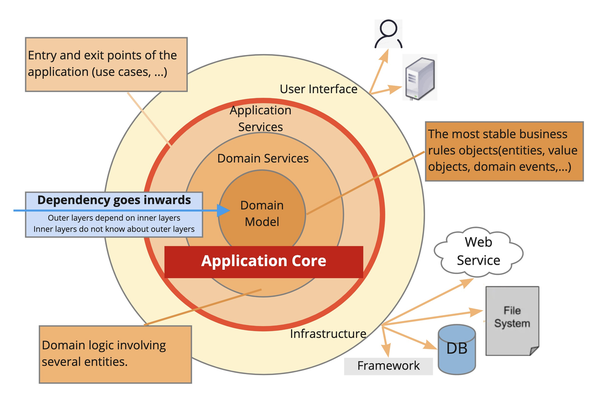
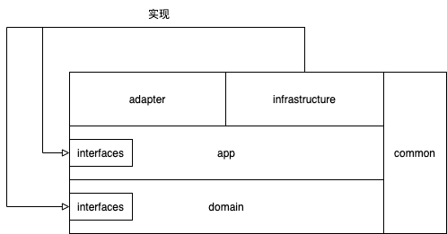

# 洋葱架构 Demo



## 洋葱架构介绍
2008 年 Jeffrey Palermo 提出了洋葱架构(属于应用架构)。通过分离关注点（即：分离业务复杂性与技术复杂性，分离业务不变性与可变性）在其内部构建出稳定、灵活、可演进的模型。具有以下特点：
- 核心模型稳定性高
- 核心模型可测试性高，可达到 100% 测试覆盖率
- 核心模型独立于基础设施，与 DB、Redis、RPC 等无关
  共分为三层，分别是领域层（领域模型和领域服务）、应用服务层、基础设施层。
  外层能依赖内层，内层不能依赖外层，即内层不能感知外层的对象、方法、类等。

## 一些说明
- 首先洋葱架构不是某种框架，它是一种分层思想，是DDD在战术落地时的最佳实践
- 本样例依据经典洋葱架构，并参考了COLA、IDDD_Samples，并适当做了调整：
  - 严格按照洋葱架构的分层结构及依赖方向，去掉了COLA中app->infrastructure的依赖
  - 考虑到增加层次带来的出入参转换成本，新增了common层，包含：dto、vo、exception，这些可以贯穿各层使用，但请注意这一层仅放不依赖基础设施的纯基础类
  - 将基础设施层划分为了adapter(北向网关)、infrastructure(南向网关)，用于区分流入流量与服务自身的基础设施
- 同时本样例也包含了一个简单的商品、订单功能实现，覆盖了增删改查、读模型、RPC调用等场景
- 弱化DomainService，鉴于过往的实践中很多同学区分不了领域服务（DomainService：业务不变性）和应用服务（AppService：产品用例，具有可变性），所以样例中没有DomainService的代码

## 分层关系


## 工程结构
```aidl
oniondemo-adapter
|- config      // 配置类
|- consumer    // 队列消费入口
|-- event      // 消费到事件的结构定义
|- controller  // 接口
|-- param      // 接口参数接口定义
oniondemo-app
|- builder     // 返回结果构造器
oniondemo-common
|- dto         // 应用服务、领域服务的入参定义
|- exception   // 异常定义
|- vo          // 应用服务、领域服务的返回值定义
oniondemo-domain
|- entity      // 领域模型（聚合根、实体、值对象）、防腐层模型、读模型
|- event       // 领域事件
|- interfaces  // 对基础实施以来的接口约定
|- repository  // 对领域模型持久化的接口约定
|- service     // 领域服务（与应用服务的区别是领域服务具有不变性，如果识别不了可以都写到应用服务中）
oniondemo-infrastructure
|- feign       // 对外的HTTP请求
|-- input      // Feign的入参结构定义
|-- output     // Feign的返回结构定义
|- mybatis     // 对Mysql的访问
|-- mapper     // mybatis的访问接口
|-- po         // 存储模型结构定义
|- persistence // 领域模型持久化的实现，实现了领域模型到存储模型的转换与落库
|- publisher   // 对事件发布的实现
|- service     // 对应用层、领域层的定义接口的实现
```
